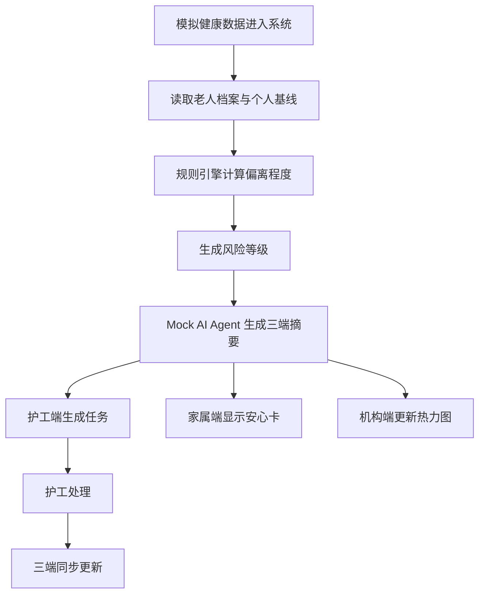

# 事件流说明

## 陈伯主线

1. 初始数据进入系统：步数 820、睡眠 4.8 小时、晚药未确认。
2. 系统读取陈伯个人基线：7 日平均步数 2150、平均睡眠 6.5 小时。
3. 规则引擎输出“需关注”。
4. 20:15 添加语音事件“我有点头晕”。
5. 规则引擎升级为“高风险”，Mock AI Agent 生成护工、家属、机构摘要。
6. 护工端生成高优先级任务。
7. 护工接单、确认晚药、完成处理。
8. 家属端和机构端同步显示“已跟进 / 持续观察”。
